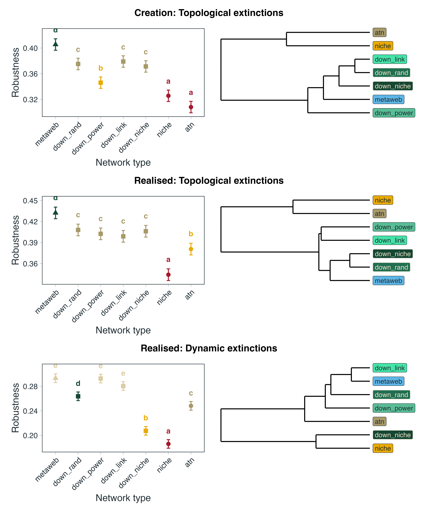

# Introduction

Ecological networks provide one of the most powerful frameworks for understanding how biodiversity is organised and how ecological communities respond to environmental change. Historically, food-web research focused largely on describing structural properties such as connectance, trophic organisation and degree distributions, revealing remarkably consistent patterns across ecosystems [@Williams2000Simple]. Increasingly, however, the focus has shifted from describing network architecture to predicting ecological processes. Mechanistic dynamic food-web models now allow researchers to investigate community stability, biomass dynamics, extinction cascades and ecosystem responses to perturbation by explicitly simulating the transfer of energy through interacting species [@yodzisBodySizeConsumerResource1992; @broseConsumerResourceBodySize2006; @curtsdotterRobustnessSecondaryExtinctions2011; @delmasSimulationsBiomassDynamics2017]. These approaches represent an important advance over purely topological analyses because secondary extinctions emerge from ecological dynamics—including resource limitation, interaction strengths and feedbacks—rather than simply from the structural loss of trophic links. As a result, dynamic food-web models are increasingly used to address questions spanning conservation biology, ecosystem functioning and macroecological responses to environmental change.

Despite these advances, the application of dynamic food web models remains constrained by an often overlooked problem - the nature of the network used as model input. Dynamic simulations require a realised interaction network representing trophic interactions that can occur simultaneously within a community, yet the networks used to construct these models vary considerably in both their provenance and ecological representation. Synthetic networks, such as those generated by the Cascade [@cohenStochasticTheoryCommunity1985] and Niche [@Williams2000Simple] models, provide useful theoretical abstractions of food web structure and can be readily coupled to dynamic models, but are not intended to represent particular communities. More detailed networks can instead be constructed from empirical observations or inferred using biological information such as body size, energetics and trophic constraints. Mechanistic approaches such as the Allometric Diet Breadth Model (ADBM; @petcheyTrophicallyUniqueSpecies2008) and Allometric Trophic Networks (ATNs; @broseConsumerResourceBodySize2006), for example, can generate empirically parameterised networks. However, these models require detailed data (abundances and body sizes) and it remains to be seen if they are able to accurately recover specific pairwise interactions as they do not account for trait-based compatibility between specific species pairs [@strydomScalingMetawebsRealised2026; @strydomAreWeMapping2026]. Conversely, a literature- or inference-derived metaweb only represents feasible pairwise interactions for species in a community [@dunneNetworkStructureFood2006a].

This distinction is important because empirical provenance does not necessarily imply realised ecological structure. Metawebs can incorporate substantial information about real ecological interactions while aggregating interactions observed or inferred across locations, seasons, sampling periods or environmental contexts [@dunneNetworkStructureFood2006a]. They therefore provide a potentially powerful empirical basis for dynamic modelling, but typically contain more interactions than are realised simultaneously within any particular community. For regional metawebs, exploiting this information in a dynamic framework consequently requires an additional network realisation step - selecting from the pool of potential interactions to generate plausible community-level networks. Such network realisation is more than a computational reduction in connectance; it is an ecological modelling decision that determines which interactions are assumed to occur together.

The need for 'metaweb realisation' is particularly apparent when considering ecological systems for which dynamic predictions could be most informative but empirical data are inherently incomplete. Palaeoecological records, for example, can provide unusually valuable opportunities to study the ecological consequences of major extinction events because fossil assemblages can document communities before and after large-scale biodiversity loss [@roopnarineNetworksExtinctionPaleocommunity2017; @roopnarineExtinctionCascadesCatastrophe2006; @frickeCollapseTerrestrialMammal2022; @dunhillExtinctionCascadesCommunity2024; @karapunarNoGlobalCollapse2026]. Yet even where species composition and trophic interactions can be reconstructed, palaeoecological data rarely provide a complete observation of a single realised food web. Instead, they are more naturally used to reconstruct empirically constrained interaction pools from which plausible community networks can be inferred. This creates an opportunity for dynamic food-web modelling - provided metawebs can be converted into dynamically viable realised networks. Empirically-informed ecological change has the potential be used to test mechanistic explanations through comparisons before and after extinction event or more complex hindcasting exercises [@strydomRoadmapPredictingSpecies2021].

However, the process of metaweb realisation itself has the potential to introduce assumptions that may propagate into subsequent ecological inference. In this sense, realised-network generation constitutes an ecological model in its own right, introducing structural assumptions before any population dynamics are simulated. These assumptions may then be compounded by the dynamics themselves. Once a realised network has been generated, dynamic models typically undergo a burn-in period during which biomass redistributes and species unable to persist under the chosen dynamical formulation are lost. Burn-in therefore represents a further filtering step, transforming a structurally feasible network into a dynamically viable community. Only after these successive stages of network realisation and dynamical filtering are perturbations, such as species removals or environmental change, imposed. Ecological inference from dynamic food web models is consequently conditioned not only by the dynamical formulation of the model, but also by assumptions introduced during network construction and by the subsequent process of dynamical realisation.

Here we investigate whether alternative approaches to network realisation influence the behaviour of subsequent ecological models. Using empirical metawebs, we generate ensembles of realised food webs using four ecologically motivated downsampling algorithms representing contrasting hypotheses of interaction realisation, alongside realised networks generated using Niche and ATN models as additional benchmarks. We then evaluate how these assumptions influence network structure, dynamical burn-in and extinction simulations. Our objective is not to identify an optimal downsampling algorithm, nor to suggest that any single approach provides the correct realised community. Rather, we present network realisation as a proof of concept for integrating empirical interaction pools into dynamic food-web models, while testing whether the ecological signatures introduced during this step remain detectable throughout the subsequent modelling process. More broadly, we ask whether 'realised metawebs' can provide a viable bridge between observed ecological interaction structure and mechanistic dynamic modelling, and whether the assumptions required to construct that bridge ultimately become as influential as the ecological dynamics themselves.

# Methods

## Data

Seven locations [@karapunarNoGlobalCollapse2026]. Here we use the guild-level community data to keep the size of the networks manageable and well within the bounds used by @curtsdotterRobustnessSecondaryExtinctions2011. Additionally we added plankton and zooplankton data from EcoGenie models [REF] as a way to enlarge the 'base' of the network (again to better represent a realised network).

## Network construction

For the empirical networks we used the PFWIM model [@shawFrameworkReconstructingAncient2024]. *Insert brief description about trait assignments and mechanistic assumptions, mention we wanted to go as broad as possible so we used fully categorical rules*. This was then used as the base metaweb for each community. Each metaweb was then downsampled to a target connectance (see below for the different downsampling approaches). Additionally the target connectance and species richness was used to parameterise a niche model network [@Williams2000Simple]. We also constructed ATN networks [@broseConsumerResourceBodySize2006].

## Downsampling approaches

We treat downsampling as a process of **ecological realisation** rather than observation. Starting from a metaweb containing all potential trophic interactions, each downsampling approach represents an alternative ecological hypothesis describing how local ecological processes filter these potential interactions into the subset that is realised within a particular community. The different approaches therefore differ not only in their implementation, but also in the ecological assumptions they embed about how realised food webs emerge from a common regional interaction pool.

### Niche

The original niche model from @Williams2000Simple assumes that realised interactions represent the core of a consumer's trophic niche, and that these diets can be arranged along a single niche axis. In order to create a downsampling approach that mimics this we we infer a latent trophic axis directly from the metaweb using Singular Value Decomposition (SVD). It has been shown that the latent spaces described by the left and right singular vectors are closely aligned wth the generality and vulnerability of species [@strydomFoodWebReconstruction2022a] and so the SVD composition should retain the diet of the species.

Let $A$ denote the $S \times S$ adjacency matrix of the metaweb, where $A_{ij}=1$ if consumer $i$ feeds on resource $j$. We compute its singular value decomposition,

$$
A = U \Sigma V^\top,
$$

where $U$ and $V$ are the left and right singular vectors, respectively, and $\Sigma$ is the diagonal matrix of singular values. Using the leading singular value, $\sigma_1$, and corresponding singular vectors, $\mathbf{u}_1$ and $\mathbf{v}_1$, each species is assigned latent consumer and resource coordinates,

$$
c_i = \sqrt{\sigma_1}\,u_{i1},
\qquad
r_i = \sqrt{\sigma_1}\,v_{i1}.
$$

Because species can act both as consumers and as resources, these coordinates are combined to obtain a single niche position,

$$
x_i = \frac{c_i + r_i}{2},
$$

which is subsequently rescaled to lie between 0 and 1. Species with similar values of $x_i$ therefore occupy similar positions along the dominant trophic gradient of the metaweb.

For each consumer $i$, the centroid of its realised niche is

$$
\mu_i = \frac{1}{k_i}\sum_{j \in R_i} x_j,
$$

where $R_i$ is the set of resources consumed by species $i$, and $k_i$ is its trophic breadth (generality). Niche breadth is estimated as the standard deviation of prey positions,

$$
\sigma_i = \max\left(\mathrm{sd}(x_j),\,0.1\right),
$$

where the lower bound prevents unrealistically narrow niches for specialists. Niche breadth can optionally be scaled to further constrain realised diets,

$$
\sigma_i' = \alpha \sigma_i,
$$

where $\alpha$ is acts as a scaling parameter.

The probability of retaining an interaction between consumer $i$ and resource $j$ is then

$$
P_{ij} \propto
\exp\left[-\left(\frac{x_j-\mu_i}{\sigma_i'}\right)^2\right].
$$

Interactions closest to the consumer's niche centre are therefore most likely to be realised (retained), whereas interactions towards the margins of the niche are preferentially removed. Ecologically, this assumes that local communities realise the central portion of a consumer's potential trophic niche, with peripheral or opportunistic interactions occurring less consistently.

### Power-law

The power-law approach assumes that interaction realisation depends primarily on **consumer trophic breadth**. Following @roopnarineExtinctionCascadesCatastrophe2006, the retention probability for consumer $i$ is

$$
P_i \propto
\exp\left(\frac{k_i}{E}\right),
$$

where $k_i$ is consumer generality and

$$
E = S^{(y-1)/y},
$$

with $S$ denoting network size and $y$ the scaling exponent. Probabilities are subsequently normalised to lie between 0 and 1. Every interaction belonging to consumer $i$ inherits the same retention probability,

$$
P_{ij}=P_i.
$$

Ecologically, this represents the hypothesis that generalist consumers realise a larger fraction of their potential trophic niche than specialist consumers, irrespective of the identity of individual resources.

### Degree-product

The degree-product approach assumes that interaction realisation depends on the centrality of both interacting species. Each interaction is assigned a weight

$$
w_{ij}=k_i^{\mathrm{out}}k_j^{\mathrm{in}},
$$

where $k_i^{\mathrm{out}}$ is the consumer's out-degree (generality) and $k_j^{\mathrm{in}}$ is the resource's in-degree (vulnerability). Retention probabilities are then calculated as

$$
P_{ij}
=
1-
\frac{w_{ij}}{\max(w)},
$$

before being constrained to the interval $[0,1]$. Under iterative downsampling, degrees are recalculated following each interaction removal, allowing probabilities to evolve as the realised network changes. Ecologically, this assumes that highly connected species possess many potential interactions that are not simultaneously realised within any local community, whereas interactions involving more specialised or weakly connected species are more likely to represent essential realised links.

### Random

Random downsampling provides the ecological null model. Every interaction has an equal probability of being retained,

$$
P_{ij}=c,
$$

where $c$ is constant for all existing interactions. Interactions are removed uniformly at random until the target connectance is reached, subject to the constraint that species cannot become isolated. This assumes that no ecological process preferentially favours the realisation of one potential interaction over another, such that realised food webs constitute an unbiased subset of the regional metaweb that is ultimately only constrained by the number of links.

## Simulations

For each empirical community, we generated 30 replicate network ensembles. Species body masses were sampled independently from truncated log-normal distributions constrained by their categorical body-size classifications. Initial biomasses were drawn from a uniform distribution. These trait values were used to construct a series of alternative networks, representing different two realised networks (ATN and niche model), one metaweb, and four downsampled (realised) metawebs (niche, power-law, degree-product, and random).

For the allometric trophic network (ATN), interaction strengths were generated by varying the feeding threshold between 0.01 and 0.12 and selecting the network whose connectance most closely matched a target connectance. Target connectance was independently sampled for each replicate from a truncated normal distribution bounded between 0.05 and 0.15. The target connectance and richness of the metaweb were used to build a niche model and the metaweb was downsampled until the target connectance was reach. These represent the 'creation' networks.

Each creation network was then parameterised using the END package [@delmasSimulationsBiomassDynamics2017] and simulated for up to 5000 time steps. Simulations terminated early if a dynamical equilibrium was reached. Species whose biomass declined below the survival threshold ($10^{-12}$) during this burn-in period were considered extinct and removed from the network. The surviving species and their interactions constituted the corresponding 'realised' networks.

Extinction experiments were subsequently performed on both the creation and realised networks. Topological extinction simulations were conducted on both network stages, whereas dynamic extinction simulations were performed only on realised networks. In all simulations, primary extinctions followed one of the prescribed extinction scenarios. During topological simulations, secondary extinctions occurred when species lost all prey, these were allowed to cascade. During dynamic simulations, primary extinctions were imposed by setting the biomass of the focal species to the survival threshold ($10^{-12}$), after which the community was simulated for a further 5000 time steps to allow biomass dynamics to relax. Species whose biomass subsequently declined below the survival threshold were recorded as secondary extinctions. This procedure was repeated until the entire community collapsed.

For each extinction scenario, robustness was quantified from the resulting extinction curves as the proportion of primary extinctions required to produce a 50% reduction in species richness ($R_{50}$ [@jonssonReliabilityR50Measure2015]), estimated by linear interpolation between extinction events.

## Software

Network construction and extinction simulations were run in Julia v1.12.6 [@bezansonJuliaFreshApproach2017], we used `EcologicalNetworksDynamics.jl` [@lajaaitiEcologicalNetworksDynamicsjlJuliaPackage2025] for dynamic simulations, `PFIM.jl` [REF] for construction of metawebs, `FoodWebTools.jl` [REF] for network downsampling, and Extinctions.jl [REF] for extinctions and robustness calculations. Statistical analyses were run in R v4.5.2 [REF]. All code can be found at *TODO*

> Keep the narrative extinction centric for now but remember we also have the topology of each network before the various extinction simulations begin

# Downsampling and burn-in alter network topology in method-dependent ways

Redundancy analysis (RDA), using permutation-based significance testing while accounting for community-level variation, revealed that downsampling approach significantly affected network topology, but that this effect depended on the magnitude of connectance reduction required to reach the target connectance (999 permutations; $F_{7, 707}$ = 112.8, $p$ = 0.001; @fig-downsample, panel A). The model explained 31.8% of total topology variation (adjusted $R^2$ = 0.318), with community identity accounting for an additional 39.7% of variation. The significant interaction between downsampling approach and connectance change (marginal test; $F_{3, 707}$ = 18.90, $p$ = 0.001) demonstrated that topology trajectories differed among downsampling methods as connectance declined. Thus, the extent to which network structure diverged from the original topology depended on both the severity of downsampling and the mechanism by which interactions were removed.

![**Downsampling approach influences both network topology and subsequent structural reorganisation during burn-in.** (A) Redundancy analysis (RDA) ordination showing differences in network topology among downsampling approaches across the connectance gradient after accounting for community-level variation. (B) Estimated slopes (±95% confidence intervals) describing the relationship between the primary RDA axis and connectance change for each downsampling approach; letters denote post-hoc groupings from estimated marginal trend comparisons. (C) Principal component trajectories illustrating structural change between network creation and burn-in for each downsampling approach. (D) Mean Euclidean displacement through PCA space during burn-in (±95% confidence intervals); letters indicate pairwise differences among network types from estimated marginal means. Networks sharing the same letter are not significantly different.](figures/downsamplingEffect.png){#fig-downsample}

To identify the source of this interaction, the response of the primary RDA axis was examined across the connectance gradient. RDA1 was strongly associated with connectance change ($F_{1, 712}$ = 2076.86, $p$ < 0.001), with additional effects of downsampling approach ($F_{3, 712}$ = 33.28, $p$ < 0.001) and a significant downsampling approach $\times$ connectance change interaction ($F_{3, 712}$ = 4.81, $p$ = 0.003). Pairwise comparisons of estimated trajectory slopes showed that link-based downsampling followed a distinct trajectory, differing from niche-, power-, and random-based downsampling, whereas the latter three approaches exhibited statistically indistinguishable responses (@fig-downsample, panel B). These results indicate that all downsampling methods alter network topology as connectance declines, but that removing interactions according to their realised connectivity produces a fundamentally different pathway of structural change from approaches that incorporate species-level ecological information or random link loss.

We next asked whether these structurally distinct networks responded differently during dynamic burn-in. Structural reorganisation was quantified as the Euclidean displacement between network positions before and after burn-in in the first three principal component dimensions, with community included as a random effect to account for the substantial variation among communities. Burn-in displacement differed significantly among network types ($F$ = 62.0, $p$ < 0.001). Metawebs underwent the greatest structural reorganisation, whereas ATNs exhibited the smallest displacement. Among the downsampled networks, niche-, power-, and link-based approaches underwent comparable structural change during burn-in, while random downsampling showed a modestly greater displacement (@fig-downsample, panels C–D).

Together, these analyses demonstrate that downsampling approach influences network topology both during network construction and subsequent dynamic relaxation. Differences among downsampling methods become increasingly pronounced as greater proportions of interactions are removed, consistent with the expectation that the ecological assumptions underlying each removal strategy exert a stronger influence under more aggressive downsampling. Importantly, despite generating distinct initial topologies, the different downsampling approaches underwent remarkably similar structural reorganisation during burn-in, changing in ways more similar to the niche model than the original metaweb. In contrast, random downsampling remained distinct throughout burn-in, consistent with its lack of an underlying ecological mechanism governing interaction removal. This suggests that the ecologically informed downsampling on metawebs allows us to produce networks whose subsequent structural dynamics more closely resemble those of the niche model. Notably the two realised models (Niche and ATN) do not behave similarly and still end up at different 'end points' post burn-in to the empirical webs, highlighting that network reconstruction approach will still have a strong effect on the inferred dynamics and behaviour of the system [@strydomAreWeMapping2026]

# Differences in inferred robustness of topological and dynamic are unaffected by network type

To determine whether the qualitative differences between topological and dynamic extinction simulations previously demonstrated using niche-model food webs generalise across alternative network reconstructions, we compared the difference in robustness ($\Delta R_50$) among network types for each extinction scenario while accounting for community-level variation. Network type significantly affected $\Delta R_50$ in all four extinction scenarios (low-to-high biomass: $F_{6, 1248}$ = 22.3, $p$<0.001; high-to-low biomass: $F_{6, 1248}$ = 46.7, $p$<0.001; random basal: $F_{6, 1248}$ = 109.0, $p$<0.001; random consumer: $F_{6, 1248}$ = 22.9, $p$<0.001), indicating that the magnitude of the difference between topological and dynamic robustness depended on network reconstruction.

Despite these quantitative differences, the qualitative pattern identified by @curtsdotterRobustnessSecondaryExtinctions2011 was largely maintained. Under all but random basal removal, topological extinction simulations inferred greater robustness than dynamic simulations for every network type, although the magnitude of this discrepancy varied among reconstruction methods [@fig-TopoVDynamic]. Random basal extinction represented the only notable departure from this general pattern. Here, the discrepancy between topological and dynamic robustness was substantially reduced, with link- and power-downsampled networks exhibiting slightly positive values of $\Delta R_50$ and random downsampled networks showing little difference between the two approaches, whereas niche-derived networks retained lower dynamic than topological robustness. Thus, the conclusion that topological analyses provide more conservative estimates of robustness was not universal, but remained remarkably robust across reconstruction methods and extinction scenarios.

![**Differences between topological and dynamic estimates of network robustness.** Boxplot showing aggregated realised topological and dynamic robustness across the different communities and extinction scenarios for the different network types. See the [*SUPP MATT*] for by extinction scenario breakdowns. Note that the pattern of 'conservative-ness' is persistent across all extinction scenarios with the exception of random, basal extinctions in which the difference was diminished and in some cases reversed](figures/robustnessTopoVDynamic.png){#fig-TopoVDynamic}

Together, these analyses demonstrate that the principal conclusion of @curtsdotterRobustnessSecondaryExtinctions2011 extends well beyond the niche model. While the precise magnitude of the discrepancy between topological and dynamic robustness depends on both network reconstruction and extinction mechanism, the qualitative tendency for topological extinction simulations to infer greater robustness than dynamic simulations was recovered across the vast majority of reconstructed food webs examined here.

# Dynamic extinctions re-enforce ecological assumptions

To evaluate how interaction filtering influences dynamic behavior, we calculated pairwise contrasts of inferred robustness ($R_{50}$) across all combinations of community, extinction mechanism, and network type. In aggregate, topological extinctions (evaluated both at network creation and after dynamic burn-in (realisation)) yielded consistent robustness estimates across all empirically derived networks (@fig-robDynamic, left column). This structural cohesion was further reflected in hierarchical clustering, where empirically derived networks consistently formed a distinct cluster separate from the two synthetic benchmark networks (niche model and ATN; @fig-robDynamic, right column). 

{#fig-robDynamic}

However, under dynamic extinction simulations, this grouping broke down. Introducing dynamic biomass interactions caused a distinct reshuffling in the relative relationships among network types (@fig-robDynamic, bottom row). Most notably, the downsampled niche networks yielded robustness estimates that converged with those of the synthetic niche model, whereas the remaining empirically derived networks maintained their mutual similarity. Additionally, the ATN model shifted to become more similar in robustness to the empirical cluster.

Topological extinction simulations primarily interrogate network architecture, and therefore retain the common structural signature inherited from the metaweb. Dynamic simulations introduce a second layer of ecological structure through biomass and rate-dependent interactions, revealing differences among networks that are not apparent from topology alone.

When examining topological extinctions, it is clear why empirically derived networks behave similarly to one another - they share a common baseline architecture inherited from the regional metaweb (@fig-downsample, panel B), and topological cascades depend strictly on network topology. For dynamic extinctions, however, network behaviour is not determined solely by initial structure. Instead, higher-order differences emerge from how functional parameterisation interacts with network topology. In the bio-energetic food web (BEFW) framework, species body mass dictates key functional parameters, including metabolic and consumption rates [@delmasSimulationsBiomassDynamics2017]. Because species body masses were assigned based on trophic position, the dynamic convergence of the synthetic niche model and the SVD-downsampled niche network likely reflects their shared trophic organisation. Consequently, dynamic simulations do not merely evaluate network structure; they actively re-enforce the ecological assumptions embedded during network construction.

# Conclusions

Reconstructing realised food webs from regional interaction pools requires assumptions about which potential interactions are likely to occur together. Here, we demonstrate that empirical metawebs can be converted into dynamically tractable food webs through alternative downsampling approaches, but that the resulting networks retain detectable signatures of the assumptions used during their construction. These signatures were evident in network topology and persisted through subsequent dynamical simulations, indicating that network realisation is not simply a preprocessing step but an additional component of the ecological model.

Our results further suggest that dynamical burn-in represents a second form of network realisation. Although burn-in altered the structure of all networks, it did not erase the differences introduced during initial network construction. Instead, the dynamical model filtered structurally feasible networks according to its own assumptions about biomass, interaction strengths and species persistence. The ecological behaviour of a simulated community is therefore shaped by successive filters: how potential interactions are realised into a network, and how that network is subsequently realised as a dynamically viable community.

> Possible supplement here is to look at the difference between creation and realised topological robustness. If we see a clear difference then clearly the burn in process is altering structure.

Importantly, the broad relationship between topological and dynamic robustness was consistent across network reconstruction approaches, even though the absolute robustness of individual networks varied. This suggests that some conclusions drawn from network topology may be robust to uncertainty in network reconstruction, while also demonstrating that dynamic simulations can reveal differences among networks that are not apparent from topology alone. In particular, networks generated from the same empirical interaction pool could exhibit distinct dynamical behaviour depending on the assumptions used to realise that pool, supporting the growing synthesis that we cannot neglect the decisions that are made when a network is initially constructed [@strydomAreWeMapping2026; @brimacombeShortcomingsReusingSpecies2023].

These findings highlight an important challenge for the growing use of dynamic food web models to move beyond describing network structure towards predicting ecological change. Increasingly sophisticated approaches can construct networks from empirical observations or biological traits, while regional metawebs provide a means of retaining broad empirical information on interaction potential. Yet neither empirical provenance nor mechanistic parameterisation necessarily produces a realised community: both require assumptions about which interactions occur together and, in dynamic models, which of those interactions can persist. Network realisation therefore represents a necessary but currently underappreciated bridge between empirical interaction data and mechanistic dynamic modelling.

This distinction may be particularly important for systems in which empirical interaction data are necessarily incomplete, including palaeoecological communities. Fossil records can provide unusually valuable opportunities to examine ecological change across major extinction events, but the interaction data available from such systems are often better interpreted as empirically constrained interaction pools than complete realised food webs. If these pools can be converted into plausible dynamically viable communities, dynamic modelling could provide a route to testing mechanistic explanations of observed ecological change rather than relying solely on topological reconstructions. Our results provide a first step towards this goal, while demonstrating that the assumptions required to construct the network can remain detectable throughout the modelling process.

Rather than identifying a single correct method for constructing realised networks, we therefore argue that network realisation should be treated as an explicit source of ecological model uncertainty. As food web modelling increasingly combines empirical interaction data with dynamical approaches, predictions will depend not only on the equations governing population dynamics, but also on how empirical knowledge is translated into the network those equations operate upon. Understanding and quantifying this additional layer of uncertainty will be essential if dynamic food-web models are to provide increasingly empirical predictions of how ecological communities respond to environmental change.

# References {.unnumbered}

::: {#refs}
:::
