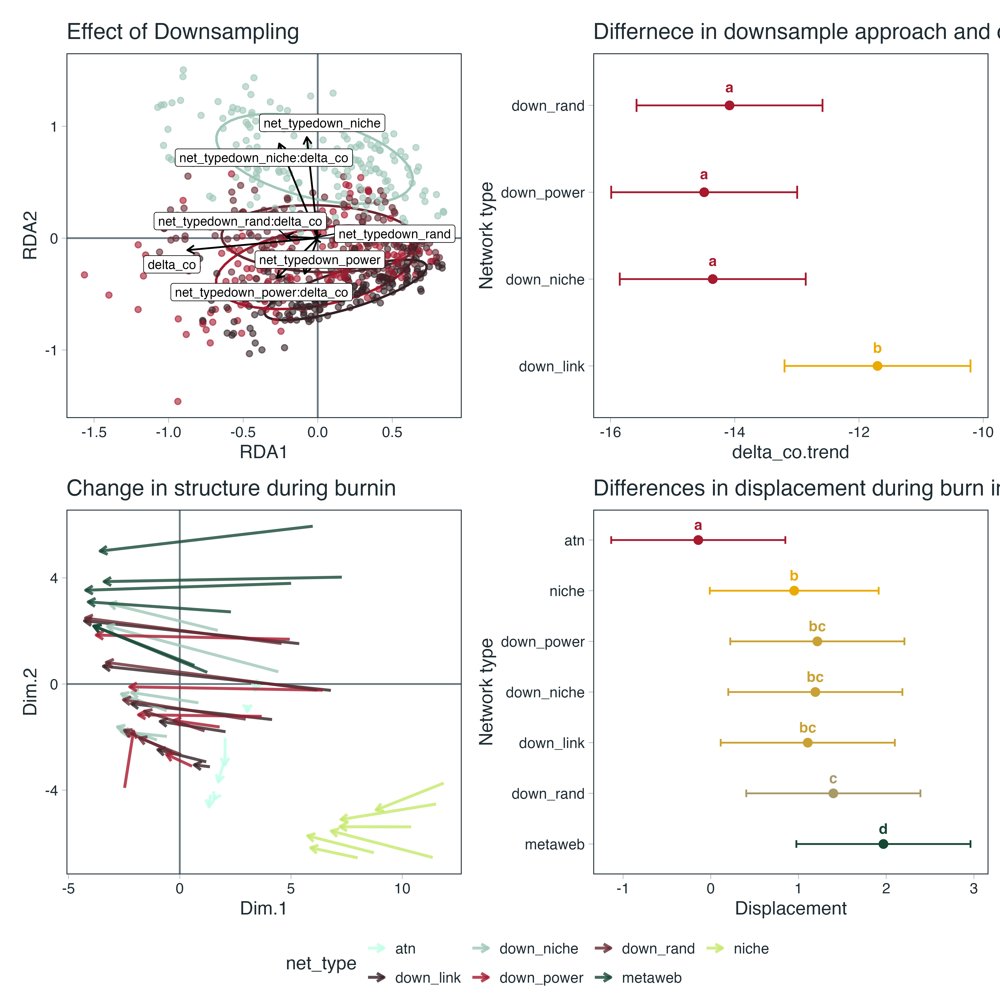
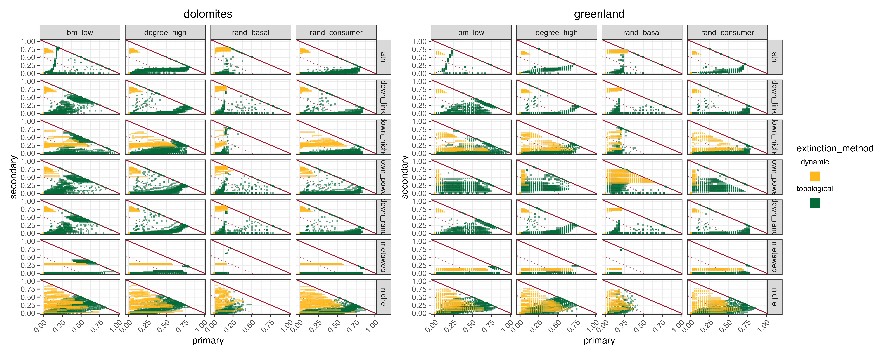

# Introduction

Extinction simulation in networks are useful because they can inform us as to the robustness [REF] or resilience [REF] of the system. Understanding community level extinctions is of particular interest for understanding community collapse and mass extinction events [REFs]. However the nature of the fossil record means that we are only able to do topological extinctions [REFs]

Dynamic extinctions [*e.g.,* @curtsdotterRobustnessSecondaryExtinctions2011] can be useful because they are (probably) a better approximation of reality - or at least not as 'conservative'/best case scenario as what the topological extinctions are (insert a brief description of how these approaches are different). Something about how this is meaningful in paleo but also real-world settings. Maybe also point out that typically in dynamic context we are using species agnostic models *e.g.,* niche and atn which lack the real world tractability that we want.

However in order to *correctly* match the philosophy of these dynamic networks we need a way in which to turn empirical metawebs into networks that are more representative of realised networks, *i.e.,* there is some form of link distribution constraint [@strydomScalingMetawebsRealised2026]. Although there has been some work on downsampling of paleo webs [@roopnarineExtinctionCascadesCatastrophe2006] we lack any ground truthing of what the implications are of embedding these ecological assumptions. Additionally this downsampling approach makes insidious assumptions as to what is driving the distribution of links in a network. Possibly also add a sentence here about how the other work has focused on the niche model [@curtsdotterRobustnessSecondaryExtinctions2011; @jonssonReliabilityR50Measure2015] which itself has its own sets of ecological assumptions/embeddings.

Here we present a selection of downsampling approach that are built on different assumptions as to link constraints. Using these downsampling approaches we recreate the @curtsdotterRobustnessSecondaryExtinctions2011 approach and test if we see difference in topological and dynamic extinctions, as well as if the different input networks have different signals. We do this using the same dataset from @karapunarNoGlobalCollapse2026. If realised webs emerge through different ecological filters, do our conclusions about dynamic extinctions depend on which realisation process we assume?

# Methods

## Data

Seven locations [@karapunarNoGlobalCollapse2026]. Here we use the guild-level community data to keep the size of the networks manageable and well within the bounds used by @curtsdotterRobustnessSecondaryExtinctions2011. Additionally we added plankton and zooplankton data from EcoGenie models [REF] as a way to enlarge the 'base' of the network (again to better represent a realised network).

## Network construction

For the empirical networks we used the PFWIM model [@shawFrameworkReconstructingAncient2024]. *Insert brief description about trait assignments and mechanistic assumptions, mention we wanted to go as broad as possible so we used fully categorical rules*. This was then used as the base metaweb for each community. Each metaweb was then downsampled to a target connectance (see below for the different downsampling approaches). Additionally the target connectance and species richness was used to parameterise a niche model network [@Williams2000Simple]. We also constructed ATN networks [@broseConsumerResourceBodySize2006].

## ## Downsampling approaches

We treat downsampling as a process of **ecological realisation** rather than observation. Starting from a metaweb containing all potential trophic interactions, each downsampling approach represents an alternative ecological hypothesis describing how local ecological processes filter these potential interactions into the subset that is realised within a particular community. The different approaches therefore differ not only in their implementation, but also in the ecological assumptions they embed about how realised food webs emerge from a common regional interaction pool.

### Niche

The niche approach assumes that realised interactions represent the core of a consumer's trophic niche. A one-dimensional latent niche axis, $x_i$, is first estimated from the interaction matrix using the leading singular vectors of the Singular Value Decomposition (SVD). For each consumer $i$, the centroid of its realised niche is

$$
\mu_i = \frac{1}{k_i}\sum_{j \in R_i} x_j,
$$

where $R_i$ is the set of resources consumed by species $i$, and $k_i$ is its trophic breadth (generality). Niche breadth is estimated as the standard deviation of prey positions,

$$
\sigma_i = \max\left(\mathrm{sd}(x_j),\,0.1\right),
$$

it is also possible to scale the niche breadth to further constrain niche breadth,

$$
\sigma_i' = \alpha \sigma_i.
$$

The probability of retaining an interaction between consumer $i$ and resource $j$ is then

$$
P_{ij} \propto
\exp\left[-\left(\frac{x_j-\mu_i}{\sigma_i'}\right)^2\right].
$$

Interactions closest to the consumer's niche centre are therefore most likely to be realised, whereas interactions towards the margins of the niche are preferentially removed. Ecologically, this assumes that local communities realise the central portion of a consumer's potential trophic niche, with peripheral or opportunistic interactions occurring less consistently.

### Power-law

The power-law approach assumes that interaction realisation depends primarily on **consumer trophic breadth**. Following @roopnarineExtinctionCascadesCatastrophe2006, the retention probability for consumer $i$ is

$$
P_i \propto
\exp\left(\frac{k_i}{E}\right),
$$

where $k_i$ is consumer generality and

$$
E = S^{(y-1)/y},
$$

with $S$ denoting network size and $y$ the scaling exponent. Probabilities are subsequently normalised to lie between 0 and 1. Every interaction belonging to consumer $i$ inherits the same retention probability,

$$
P_{ij}=P_i.
$$

Ecologically, this represents the hypothesis that generalist consumers realise a larger fraction of their potential trophic niche than specialist consumers, irrespective of the identity of individual resources.

### Degree-product

The degree-product approach assumes that interaction realisation depends on the centrality of both interacting species. Each interaction is assigned a weight

$$
w_{ij}=k_i^{\mathrm{out}}k_j^{\mathrm{in}},
$$

where $k_i^{\mathrm{out}}$ is the consumer's out-degree (generality) and $k_j^{\mathrm{in}}$ is the resource's in-degree (vulnerability). Retention probabilities are then calculated as

$$
P_{ij}
=
1-
\frac{w_{ij}}{\max(w)},
$$

before being constrained to the interval $[0,1]$. Under iterative downsampling, degrees are recalculated following each interaction removal, allowing probabilities to evolve as the realised network changes. Ecologically, this assumes that highly connected species possess many potential interactions that are not simultaneously realised within any local community, whereas interactions involving more specialised or weakly connected species are more likely to represent essential realised links.

### Random

Random downsampling provides the ecological null model. Every interaction has an equal probability of being retained,

$$
P_{ij}=c,
$$

where $c$ is constant for all existing interactions. Interactions are removed uniformly at random until the target connectance is reached, subject to the constraint that species cannot become isolated. This assumes that no ecological process preferentially favours the realisation of one potential interaction over another, such that realised food webs constitute an unbiased subset of the regional metaweb that is ultimately only constrained by the number of links.

## Simulations

For each empirical community, we generated 30 replicate network ensembles. Species body masses were sampled independently from truncated log-normal distributions constrained by their categorical body-size classifications. Initial biomasses were drawn from a uniform distribution. These trait values were used to construct a series of alternative networks, representing different two realised networks (ATN and niche model), one metaweb, and four downsampled (realised) metawebs (niche, power-law, degree-product, and random).

For the allometric trophic network (ATN), interaction strengths were generated by varying the feeding threshold between 0.01 and 0.12 and selecting the network whose connectance most closely matched a target connectance. Target connectance was independently sampled for each replicate from a truncated normal distribution bounded between 0.05 and 0.15. The target connectance and richness of the metaweb were used to build a niche model and the metaweb was downsampled until the target connectance was reach. These represent the 'creation' networks.

Each creation network was then parameterised using the END package [@delmasSimulationsBiomassDynamics2017] and simulated for up to 5000 time steps. Simulations terminated early if a dynamical equilibrium was reached. Species whose biomass declined below the survival threshold ($10^{-12}$) during this burn-in period were considered extinct and removed from the network. The surviving species and their interactions constituted the corresponding 'realised' networks.

Extinction experiments were subsequently performed on both the creation and realised networks. Topological extinction simulations were conducted on both network stages, whereas dynamic extinction simulations were performed only on realised networks. In all simulations, primary extinctions followed one of the prescribed extinction scenarios. During topological simulations, secondary extinctions occurred when species lost all prey, these were allowed to cascade. During dynamic simulations, primary extinctions were imposed by setting the biomass of the focal species to the survival threshold ($10^{-12}$), after which the community was simulated for a further 5000 time steps to allow biomass dynamics to relax. Species whose biomass subsequently declined below the survival threshold were recorded as secondary extinctions. This procedure was repeated until the entire community collapsed.

For each extinction scenario, robustness was quantified from the resulting extinction curves as the proportion of primary extinctions required to produce a 50% reduction in species richness ($R_{50}$ [@jonssonReliabilityR50Measure2015]), estimated by linear interpolation between extinction events.

## Software

Network construction and extinction simulations were run in Julia v1.12.6 [@bezansonJuliaFreshApproach2017], we used `EcologicalNetworksDynamics.jl` [@lajaaitiEcologicalNetworksDynamicsjlJuliaPackage2025] for dynamic simulations, `PFIM.jl` [REF] for construction of metawebs, `FoodWebTools.jl` [REF] for network downsampling, and Extinctions.jl [REF] for extinctions and robustness calculations. Statistical analyses were run in R v4.5.2 [REF]. All code can be found at *TODO*

> Keep the narrative extinction centric for now but remember we also have the topology of each network before the various extinction simulations begin

# Downsampling and burn-in alter network topology in method-dependent ways

Redundancy analysis (RDA), using permutation-based significance testing and accounting for community-level variation, revealed that downsampling approach significantly affected network topology, but that this effect depended on the magnitude of connectance reduction required to reach the target connectance (999 permutations; $F_{7, 707}$ = 112.8, $p$ = 0.001, @fig-downsample panel A). The model explained 31.8% of total topology variation (adjusted $R^2$ = 0.318), with community identity accounting for an additional 39.7% of variation. The significant interaction between downsampling approach and connectance change (marginal test; $F_{3, 707}$ = 18.90, $p$ = 0.001) demonstrated that topology trajectories differed among downsampling methods as connectance declined. Thus, the extent to which network structure diverged from the original topology depended on both the severity of downsampling and the downsampling mechanism by which interactions were removed.

{#fig-downsample}

To identify the source of this interaction, the response of the primary RDA axis was examined across the connectance gradient. RDA1 was strongly associated with connectance change ($F_{7, 712}$ = 2076.86, $p$ < 0.001), with additional effects of downsampling approach ($F_{3, 712}$ = 33.28, $p$ < 0.001) and a significant downsampling approach $\times$ connectance change interaction ($F_{3, 712}$ = 4.81, $p$ = 0.003). Pairwise comparisons of estimated trajectory slopes showed that link-based downsampling produced a distinct response, differing from the other three downsampling approaches. In contrast, these latter three approaches showed statistically indistinguishable trajectories [@fig-downsample panel B]. Together, these results indicate that although all approaches altered topology as connectance decreased, link-based removal generated a different pathway of structural change compared with the other downsampling approaches.

Beyond the effects of downsampling, network construction approach also influenced how topology changed during subsequent burn-in. Principal component analysis (PCA) was used to represent variation in topology space, and structural reorganisation during burn-in was quantified as the Euclidean displacement between network positions at creation and after burn-in across the first three PCA dimensions. Linear modelling showed that burn-in displacement differed significantly among network types ($F_{6, 1158}$ = 62.00, $p$ < 0.001). With the exception of the random the downsampled networks had a similar displacement to the niche model [@fig-downsample panel D], whereas metawebs and ATNs had their own distinct displacement trajectories.

Together, these analyses demonstrate that the different downsampling approaches will create structurally distinct networks, with these differences becoming more apparent the more aggressive the degree of downsampling becomes. This is unsurprising since as more links are removed the stronger the embedded ecological assumptions behind the link removal process will become. Reassuringly we see that the downsampled networks showcase similar structural changes during the burn-in phase, and that these changes are more in line with those exhibited by the niche model than the original metaweb indicating that these downsampling approaches do indeed produce networks that are more aligned with realised webs than with the original metaweb. The exception here is the random network, which is to be expected as it does not embed any ecological assumptions and thus we expect it to behave differently in dynamic settings.

# Differences in inferred robustness of topological and dynamic unaffected by network type

Still see that topological robustness is more conservative than dynamic extinctions

# Network type alters the propagation of dynamical extinctions

Report here about the secondary extinction rates as well as the pairwise contrasts.

{#fig-1}

{#fig-2}

{#fig-3}

## Relative to the niche model, niche downsampling is the closest match

Most often the ones to not be different from each other. Worth pointing out that the ATN behaves very differently as well. So again we are back at are we modelling network or model behaviour [@strydomAreWeMapping2026]

# Conclusion

# References {.unnumbered}

::: {#refs}
:::
