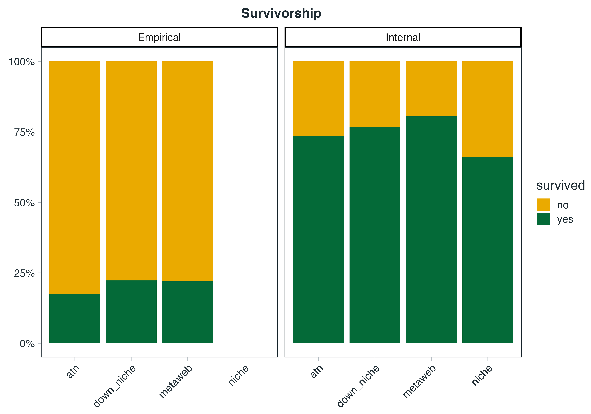
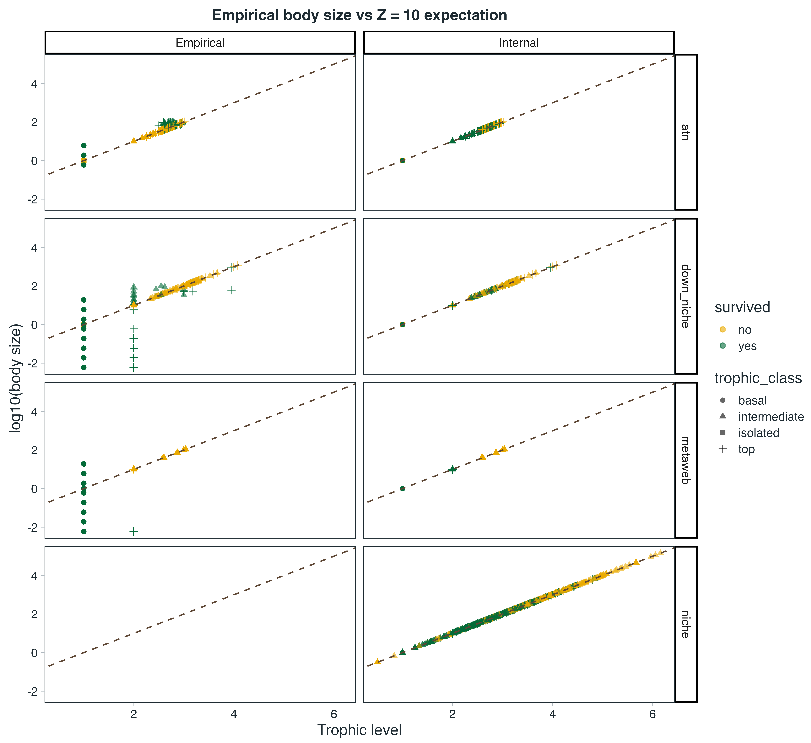
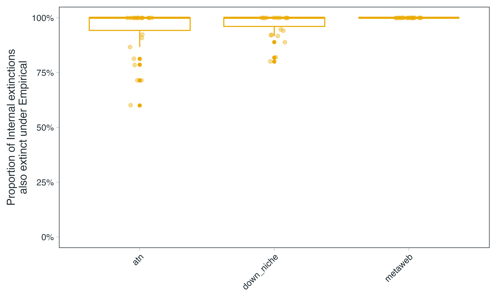
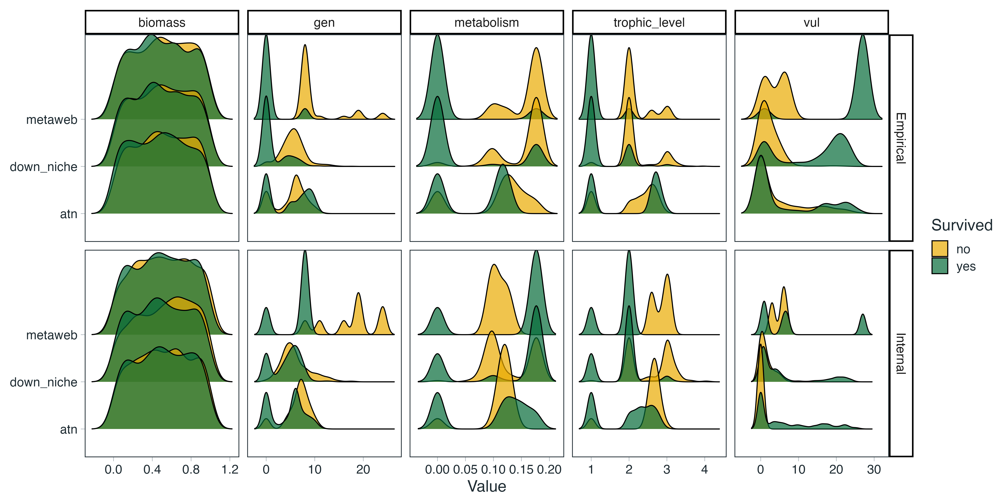
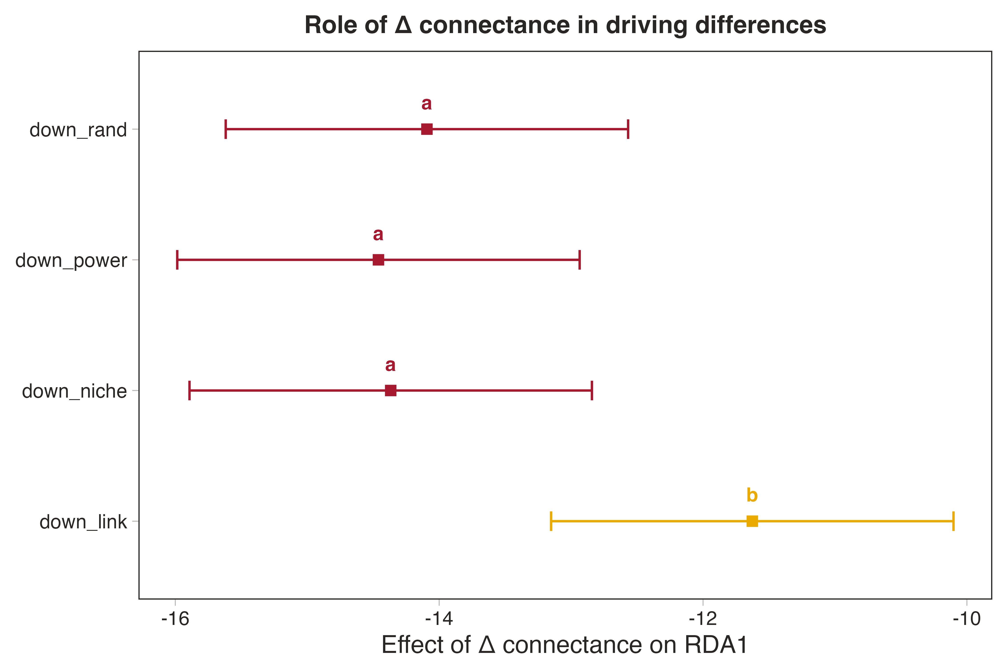
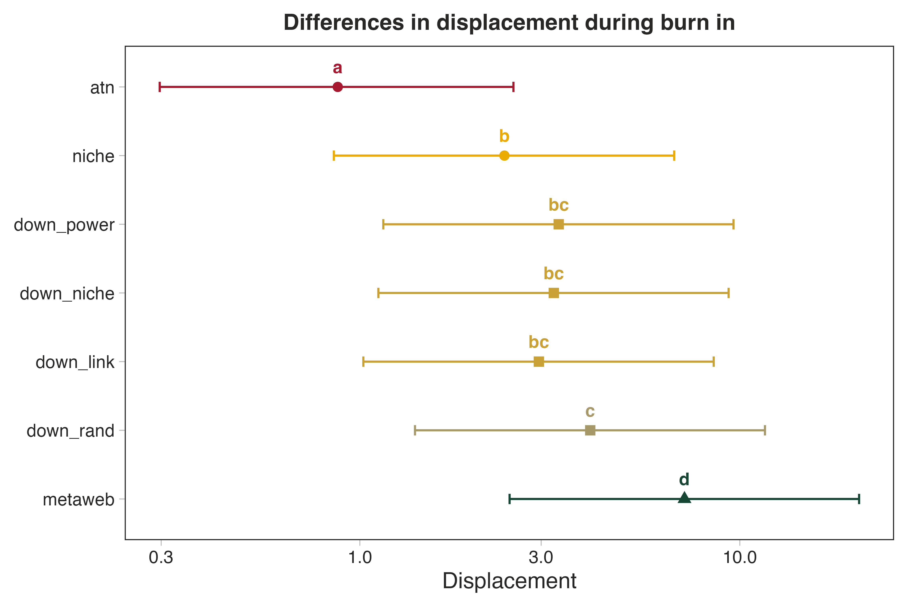
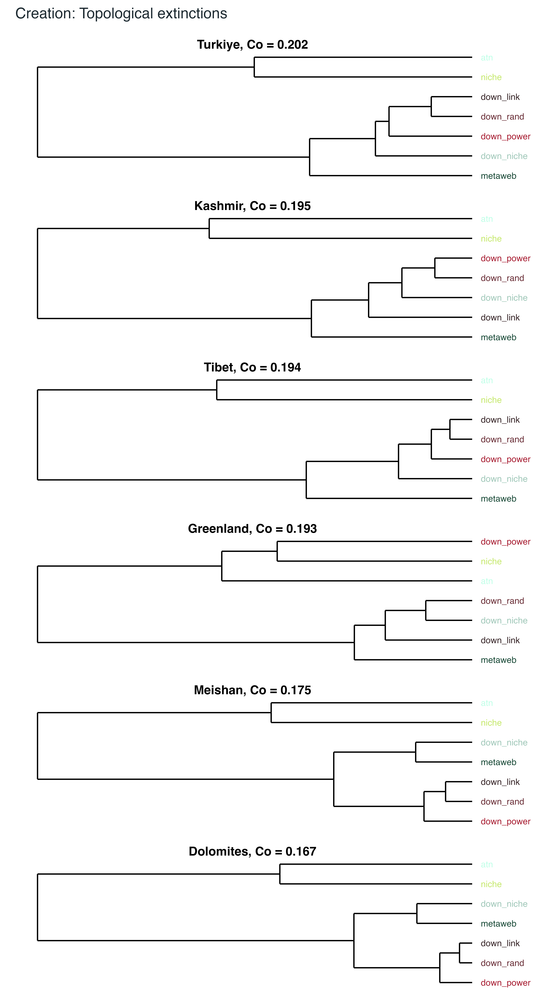
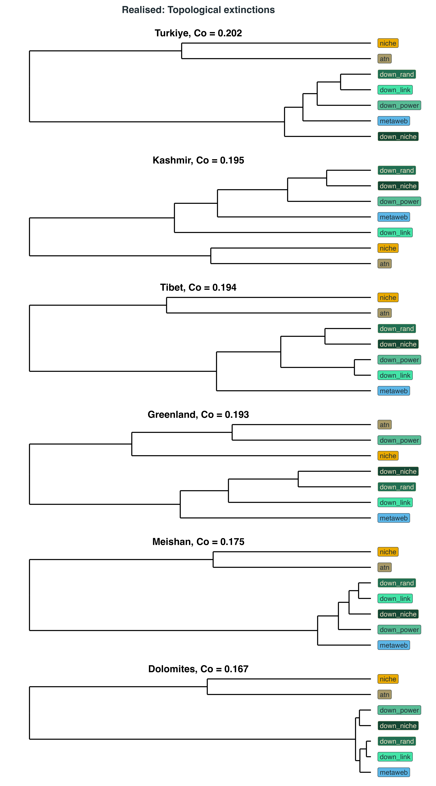
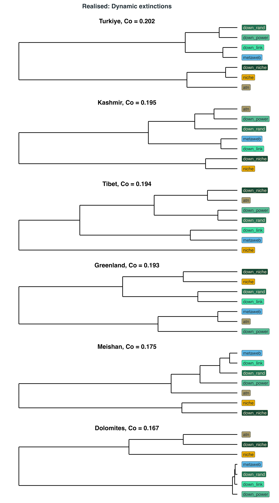

# Internal vs Empirical body size specification and the impact on survivorship

For the simulations, we opted to assign body sizes using the internal predator-prey body mass distribution specification from the `EcologicalNetworksDynamics.jl` package. Here, body mass ($M_i$) is assigned deterministically from the trophic level ($TL$) as follows: $M_{i} = Z^{TL_{i}-1}$, where $Z$ represents the assumed constant predator–prey body-mass ratio, here set to 10. This is because we had an extremely high rate of species loss during the burn-in phase, losing ~75% of all species before starting any extinction simulations.

For simplicity, here we are presenting only the community results from Türkiye for the metaweb, downsampled niche web, ATN and niche model. Here, we have the same network and the only differences are that, for the dynamic modelling component, we either use the 'empirical' body size (Empirical) or the predator-prey body mass distribution (Internal). Owing to the species-agnostic nature of the Niche model, we are not able to assign empirical body sizes. What is of interest here is that, although the ATN is constructed using the empirical body sizes, if we use those body sizes in the dynamic model we get a high extinction rate. Using the predator-prey body mass distribution specification, we instead see much higher survivorship.



By comparing $\log_{10}(body size)$ to the trophic level, we are able to see how much the empirical body sizes deviate from the expected predator-prey body mass distribution. Unsurprisingly, we see that the internally specified body sizes perfectly map onto the 1:1 line, while we do see some deviation for the empirical body sizes. Two things are worth noting. First, the 'deviation' from the predator-prey body mass relationship for the empirical ATN is not large, yet we still see a large rate of species loss. Secondly, across all the network types, the species that do survive in the Empirical webs are the ones that deviate from the predator-prey body mass relationship. Overall, this suggests that the dynamic model is incredibly sensitive to body size specifications and does suggest further investigation if we are to confidently use real-world body sizes as opposed to theoretical relationships.



Interestingly, though, we see that there is a large degree of overlap in the specific species that go extinct. Below, we show the proportion of species that go extinct when we specify the body size internally that also go extinct when we specify the body sizes using the empirical data. This suggests that there are certain species that are 'destined' for extinction and that the burn-in phase is simply pruning them [@curtsdotterRobustnessSecondaryExtinctions2011], while the additional deviation in the body size specification is what is driving the additional extinctions we see in the empirical body size networks.



This is qualitatively supported if we look at some of the species traits. Below, we show the distribution of biomass, generality (number of prey), metabolism (a trait informed by body size), trophic level, and vulnerability (number of prey), coloured by whether they survive the burn-in or not. Here, we can see similar patterns between the two body size specifications (**e.g.,** in metawebs, species with a high generality are the ones going extinct), and it is just exacerbated in the empirical body size webs. The only differences are in metabolism, where we see species with high metabolic rates going extinct in empirical body size webs and species with 'intermediate' metabolic rates going extinct in internally specified body size webs. Note also that, when looking at trophic levels, we see the loss of intermediate species in empirical body size webs. Overall, this suggests that body size specification can have massive implications for the behaviour of the dynamic model and suggests that it largely influences the indirect effect such as top-down control.



# Downsampling and burn-in alter network topology in method-dependent ways

## Figure S1: Increasing $\Delta Co$ is associated with increasing differences among network types in RDA1



The effect of $\Delta Co$ on network structure differed among network types (net type $\times$ $\Delta Co$ interaction: $F_{3, 712}$ = 4.81, $p$ = 0.0025). RDA1 declined with increasing $\Delta Co$ across all network types, but the decline was significantly weaker for degree-product downsampled networks than for down-niche, down-power and down-random networks (pairwise differences in slopes, $p$ = 0.011, 0.006 and 0.030, respectively). Thus, differences between degree-product and the other downsampled network types increased along the $\Delta Co$ gradient.

## Figure S2: Displacement of downsampled networks is more similar to that of the niche model than the original metaweb



Here, we show the mean displacement of the different network types during burn-in. Displacement was calculated as the Euclidean distance between each network's position at creation and after burn-in in three-dimensional PCA space. Points represent model-estimated mean displacements, with error bars showing 95% confidence intervals; different letters indicate significant differences between network types. Note that, with the exception of random downsampling, the downsampled networks move through PCA space in a way that is more similar to the niche model than to the metaweb, which implies that they underwent similar restructuring during burn-in.

# Differences in inferred robustness of topological and dynamic are unaffected by network type

## Table S1: Model outputs

```{r}
#| echo: false
#| warning: false
#| message: false

suppressMessages(library(knitr, quietly = TRUE))
suppressMessages(library(tidyverse, quietly = TRUE))

suppressMessages(readr::read_csv("../tables/robustnessTopoVDynamic.csv")) %>%
  knitr::kable()
```

# Differences in inferred robustness of topological and dynamic are unaffected by network type

Estimated robustness ($R_{50}$) of realised networks under topological (green) and dynamic (yellow) extinction simulations across network types and extinction scenarios. Points represent mean robustness values, with connecting lines highlighting the consistent reduction in robustness estimates when extinction cascades are evaluated dynamically. (B) Difference between dynamic and topological robustness estimates ($\Delta R_{50} = R_{50, dynamic} - R_{50, topological}$) for each network type. Negative values indicate that dynamic simulations produce lower inferred robustness than topological simulations. Bars show estimated marginal means from linear models accounting for differences among empirical communities; letters indicate significant differences among network types based on Sidak-adjusted pairwise comparisons.


# Dynamic extinctions reinforce ecological assumptions

## Contrasts

For each community $\times$ extinction scenario $\times$ time point, $R_{50}$ was modelled as a function of network type, and estimated marginal means were compared using Tukey-adjusted pairwise contrasts. Network-type pairs with adjusted $p \geq$ 0.05 were considered indistinguishable. We summarised the number and proportion of extinction scenarios in which each pair of network types was statistically indistinguishable, providing a complementary measure of similarity in inferred robustness.


## Ability to distinguish between network types

Pairwise comparisons provided a complementary measure of similarity among network types. For each community and extinction stage, we quantified the proportion of extinction scenarios in which each pair of network types had statistically indistinguishable estimates of $R_{50}$ (adjusted $p \geq$ 0.05). Similarity was generally greater among the downsampled networks than between downsampled and synthetic/reference network types, although the pattern varied among communities and extinction stages.


## Clustering

We used hierarchical clustering of estimated marginal mean $R_{50}$ values to assess broader patterns of similarity among network types. At network creation, the metaweb and three of the downsampled network types (degree-distribution, niche, and random) formed a single cluster, while the niche model and ATN formed a second cluster; interestingly, the power-law downsampled networks formed a third cluster. Following burn-in, topological robustness showed a similar overall separation, but here we see the power-law downsampled network grouping with the rest of the empirical webs, ATN forming an intermediate cluster, and the niche model remaining distinct. Under dynamic extinctions, the grouping changed substantially: the metaweb and degree-distribution, power-law, and random networks remained clustered, whereas the downsampled niche networks grouped with the synthetic niche model, and ATN formed a separate cluster.

Together, these results show that the similarity among network types in inferred robustness depends on both network construction and the processes applied after network creation. In particular, dynamic simulations altered the grouping of network types relative to their initial topological structure, with the niche-based downsampling approach converging towards the behaviour of the synthetic niche model.







# Downsampling and burn-in alter inferred topological robustness

To determine how ecological assumptions underlying downsampling influence emergent robustness, we examined how differences in robustness between downsampled networks and three reference 'states' (metaweb, ATN, and niche model) changed with increasing degree of downsampling ($\Delta_{connectance}$). As the degree of downsampling increased, robustness trajectories increasingly diverged from the original metaweb, but the direction of this divergence depended on both the ecological mechanism used to remove interactions and the extinction scenario considered.


Under body-mass ordered extinction, reductions in connectance produced increasingly divergent robustness responses relative to the metaweb, while trajectories relative to the niche and ATN reference states were weaker and more variable. This pattern was reflected in a strong interaction between connectance reduction and reference state ($\chi^2$ = 384, $p$ < 0.001). Similar reference-dependent trajectories occurred under degree-based extinction ($\Delta_{connectance}$ $\times$ reference $\times$ downsampling approach: $\chi^2$ = 98.7, $p$ < 0.001) and random consumer removal ($\chi^2$ = 22.1, $p$ = 0.001), whereas random basal removal showed little evidence that the mechanism of downsampling altered robustness trajectories ($\chi^2$ = 0.54, $p$ = 0.997).

Interestingly, burn-in further modified the relationship between downsampled networks and realised reference states. Comparison of robustness before and after burn-in showed that the process of dynamic modelling altered the magnitude and direction of divergence between downsampled networks and the metaweb, ATN, and niche references. Thus, the ecological assumptions imposed during downsampling do not fully determine the final properties of a realised network; subsequent dynamical processes provide an additional filter that can either reinforce or reduce differences among reconstruction approaches.

Together, these results demonstrate that reducing the connectance of a metaweb alone does not determine how inferred robustness changes; rather, the ecological assumptions governing which interactions are retained determine which structural properties of the metaweb are preserved and which are lost. As more links are removed, the downsampling approach increasingly imposes these assumptions, and different downsampling approaches produce distinct robustness trajectories, with the magnitude of these differences depending on the extinction scenario considered. Furthermore, dynamic burn-in modifies these relationships, demonstrating that the robustness of a reconstructed network at creation does not necessarily represent the robustness of the dynamically realised community. Therefore, conclusions drawn from extinction simulations depend not only on the extinction mechanism itself, but also on the ecological assumptions used to translate potential interactions within a metaweb into realised network structure.

# References {.unnumbered}

::: {#refs}
:::
